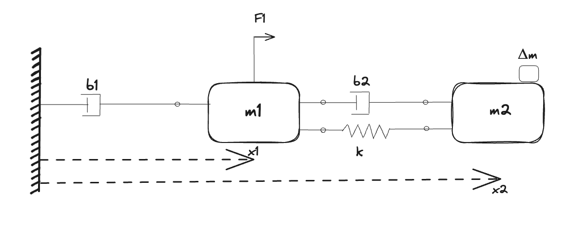

# [Parameter Estimation with Multiple Experiments](@id massspringdamper)

In this example, we will perform parameter calibration with two different experiments. The system we will calibrate is a double-mass system, where two masses are connected by a flexible shaft. An input force excites the first mass, which in turn drives the second mass through the flexible shaft. The flexibility of the shaft, modeled as a spring and damper, leads to a resonance, the properties of which we are interested in learning using data from experiments. This system is a common model of a servo mechanism, a mechanical system that uses feedback to control of a motor to accurately position a load mass. Examples of this include:

- Industrial robots
- 3D printers
- Tracking cameras and telescopes
- Overhead cranes

The mass that can be excited, representing the moving mass of the actuator, is equipped with a position sensor. However, the driven mass, the mass of the load we are interested in positioning, is not. In order to obtain sufficiently informative data, the second mass is instead temporarily equipped with an accelerometer. Extra temporary instrumentation is common in a lab setting, where the additional sensors are used to identify a model or to verify the performance of a state estimator etc.

A complicating factor in a setup like this is that it is difficult to accurately estimate both masses ``m`` and spring stiffness ``k`` at the same time. Typically, only the _ratio_ of them is easily identifiable. This can be understood from looking at the expression for the resonance frequency ``\omega`` of a simple mass-spring system,  ``\omega = \sqrt{k/m}``. However, if we perform two different experiments, where we change the mass by a known value, i.e., by adding a known quantity of additional mass, we can tease ``k`` and ``m`` apart. We will leverage this method here in order to accurately estimate all parameters of the system. We have the following parameters to estimate:

- Masses, ``m_1, m_2``
- Transmission spring stiffness, ``k``
- Transmission damping, ``b``

The two experiments will be carried out as follows:

- Experiment 1 drives the unloaded system with a known force ``F``.
- Experiment 2 adds load ``\Delta m`` to the second mass, i.e., the effective mass of the load is this ``m_2 + \Delta m`` where ``m_2`` is unknown while ``\Delta m`` is known. The same force is applied to the system as in Experiment 1.

From the classical Newton's 2nd Law of Motion, we can generate the following set of equations from the conservation equations:

```math
\begin{aligned}
m_1 \ddot{x_1} + b_1 \dot{x_1} &= k (x_2 - x_1) + b_2 (\dot{x_2} - \dot{x_1}) + F_1  \\
(m_2 + Δm) \ddot{x_2} + b_2 (\dot{x_2} - \dot{x_1}) + k (x_2 - x_1) &= 0.0  \\
\end{aligned}
```



## Julia Environment

For this example, we will need the following packages:

| Module                                                                                              | Description                                                                                |
|:--------------------------------------------------------------------------------------------------- |:------------------------------------------------------------------------------------------ |
| [DyadModelOptimizer](https://help.juliahub.com/jsmo/stable/)                                    | The high-level library used to formulate our problem and perform automated model discovery |
| [ModelingToolkit](https://docs.sciml.ai/ModelingToolkit/stable/)                                    | The symbolic modeling environment                                                          |
| [ModelingToolkitStandardLibrary](https://docs.sciml.ai/ModelingToolkitStandardLibrary/stable/)      | Library for using standard modeling components                                             |
| [OrdinaryDiffEq](https://docs.sciml.ai/DiffEqDocs/stable/)                                          | The numerical differential equation solvers                                                |
| [CSV](https://csv.juliadata.org/stable/) and [DataFrames](https://dataframes.juliadata.org/stable/) | We will read our experimental data from .csv                                               |
| [DataSets](https://help.juliahub.com/juliahub/stable/tutorials/datasets_intro/)                     | We will load our experimental data from datasets on JuliaHub                               |
| [DataInterpolations](https://docs.sciml.ai/DataInterpolations/stable/)                              | Library for creating interpolations from the data                                          |
| [Plots](https://docs.juliaplots.org/stable/)                                                        | The plotting and visualization library                                                     |

```@example coupledexperiments
using DyadModelOptimizer
using ModelingToolkit
import ModelingToolkit: D_nounits as D, t_nounits as t
using ModelingToolkitStandardLibrary.Blocks
using ModelingToolkitStandardLibrary.Mechanical.TranslationalPosition
using OrdinaryDiffEq
using CSV, DataFrames
using DyadData
using DataInterpolations
using Plots
using Test # hide
```

## Model Setup

Since the spring stiffness is numerically very large compared to the other parameters, and our apriori uncertainty about this parameter spans potentially several orders of magnitude, we let $log(k)$ be the parameter optimized by the solver. This brings the parameter into a similar numerical range as the other parameters, and makes the optimization problem more well-conditioned.

```@example coupledexperiments
function coupledsystem()
    @named mass1 = Mass(; m = 1.5, s = 0.0, v = 0)
    @parameters m2 = 3.0
    @named mass2 = Mass(; m = m2, s = 0.0, v = 0)
    @named spring = Spring(; k = 2700.0)
    @named damper1 = Damper(; d = 9.0)
    @named damper2 = Damper(; d = 15.0)
    @named wall = Fixed()
    @named force = Force()
    @named F1 = RealInput()
    @named A2 = RealOutput()
    @named accsensor = AccelerationSensor()

    tvec = collect(0:0.01:200)
    data = cos.(0.5 * tvec .^ 2) # A simple periodic driving force with increasing frequency

    @named src = Interpolation(CubicSpline, data, tvec)
    @named clk = ContinuousClock()

    eqs = [
        connect(wall.flange, damper1.flange_a),
        connect(damper1.flange_b, mass1.flange),
        connect(mass1.flange, damper2.flange_a),
        connect(damper2.flange_b, mass2.flange),
        connect(mass1.flange, spring.flange_a),
        connect(spring.flange_b, mass2.flange),
        connect(mass1.flange, force.flange),
        connect(force.f, F1),
        connect(accsensor.flange, mass2.flange),
        connect(A2, accsensor.output),
        connect(clk.output, src.input),
        connect(F1, src.output),
    ]
    @named coupsys = ODESystem(eqs, t, [], [m2];
        systems=[mass1, mass2, spring, damper1, damper2, wall, force, F1, accsensor, A2, src, clk])
    return coupsys
end

model = coupledsystem()
sys = structural_simplify(model)
```

## Data Setup

Next, we will load some data. This data is generated from simulations. For increased realism, we simulated measurement noise on both velocity and acceleration measurements. Accelerometers have a tendency to be fairly noisy, reflected in the large amount of noise added to the acceleration measurements.

```@example coupledexperiments
data1 = build_dataframe(DyadDataset("juliasimtutorials", "coupled_experiments_data_1", independent_var="timestamp", dependent_vars=["coupsys.mass1.v", "coupsys.accsensor.a"]))

data2 = build_dataframe(DyadDataset("juliasimtutorials", "coupled_experiments_data_2", independent_var="timestamp", dependent_vars=["coupsys.mass1.v", "coupsys.accsensor.a"]))
nothing #hide
```

Now, lets plot the data.

```@example coupledexperiments
plot(data1[:, "timestamp"], data1[:, "coupsys.mass1.v"], label = "Noisy velocity measurements", layout=(2, 1), size = (1000, 600), sp=1)
plot!(data1[:, "timestamp"], data1[:, "coupsys.accsensor.a"], label = "Noisy acceleration measurements", sp=2)
```

## Defining Experiments and InverseProblem

We will set up both the [`Experiment`](@ref) corresponding to `Δm` present or absent with their corresponding data. We will also use [`DiscreteFixedGainPEM`](@ref) for simulations to be guided by the data which helps in the calibration process.

```@example coupledexperiments
experiment1 = Experiment(data1, sys;
    depvars = [
        sys.mass1.v => "coupsys.mass1.v",
        sys.accsensor.a => "coupsys.accsensor.a",
    ],
    loss_func = meansquaredl2loss,
    alg = Tsit5(),
    overrides = [sys.mass2.m => sys.m2],
    model_transformations = [DiscreteFixedGainPEM(0.05)]
)

Δm = 10.0 # We add 10kg of mass to the load in the second experiment
experiment2 = Experiment(data2, sys;
    depvars = [
        sys.mass1.v => "coupsys.mass1.v",
        sys.accsensor.a => "coupsys.accsensor.a",
    ],
    loss_func = meansquaredl2loss,
    alg = Tsit5(),
    overrides = [sys.mass2.m => sys.m2 + Δm],
    model_transformations = [DiscreteFixedGainPEM(0.05)]
)
```

Next, we specify an [`InverseProblem`](@ref) of interest to us where we specify the parameters we want to recover and their bounds. We pass both the experiments as a vector.

```@example coupledexperiments
prob = InverseProblem([experiment1, experiment2], [
    sys.mass1.m => (0.0, 10.0),
    sys.m2 => (0.0, 10.0),
    sys.spring.k => (1e1, 1e4, :log),
    sys.damper1.d => (0.0, 20.0),
    sys.damper2.d => (0.0, 20.0)]
)
```

## Calibration

Now, lets use [`SingleShooting`](@ref) for calibration. To do this, we first define an algorithm `alg` and then call [`calibrate`](@ref) with the `prob` and `alg`.

```@example coupledexperiments
alg = SingleShooting(maxiters = 30, optimizer = IpoptOptimizer(tol = 1e-5, acceptable_tol = 1e-4))

r = calibrate(prob, alg)
@test r.original.objective[end] < 1e-2 # hide
@test r[:spring₊k] ≈ 2500.0 rtol=1e-2 # hide
@test r[:damper1₊d] ≈ 10.0 rtol=1e-2 # hide
@test r[:damper2₊d] ≈ 10.0 rtol=1e-2 # hide
@test r[:mass1₊m] ≈ 1.0 rtol=1e-2 # hide
@test r[:m2] ≈ 4.0 rtol=1e-3 # hide
r # hide
```

We can see the calibrated parameters closely match with their true values, i.e, `k = 2500, b1 = 10.0, b2 = 10.0, m2 = 4.0`.

## Visualization

Lets also plot the simulation with the calibrated parameters.

```@example coupledexperiments
plot(experiment1, prob, r, show_data = true, layout = (2, 1), size = (1000, 600), ms = 0.1)
```

```@example coupledexperiments
plot(experiment2, prob, r, show_data = true, layout = (2, 1), size = (1000, 600), ms = 0.1)
```

We can see it fits the data well!
