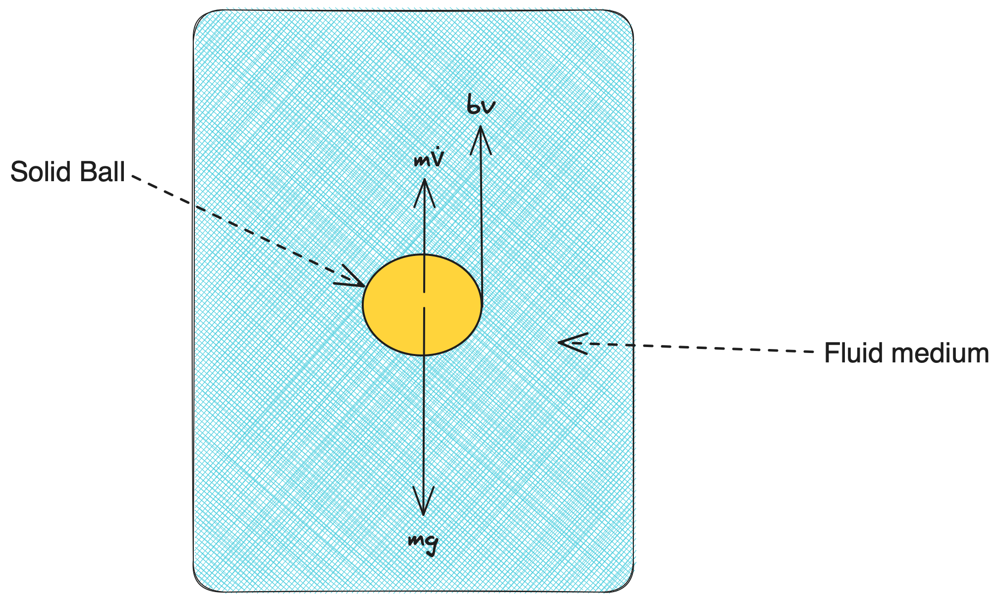

# [Calibration of a Steady State System](@id SteadyStateAnalysis)

In this example, we will demonstrate the usage of [`SteadyStateExperiment`](@ref) in DyadModelOptimizer. Here, we will consider a ball encountering a drag-force in a viscous medium. From the classical [Stoke's Law](https://en.wikipedia.org/wiki/Stokes%27_law), assuming a small spherical object falling in a medium, we can describe a linear relationship between drag-force and velocity, where `k` is defined as a constant, ${6 \pi \eta r v}$, as below:

```math
\begin{aligned}
F_v &= k*v  \\
\end{aligned}
```

## Julia Environment

For this example, we will need the following packages:

| Module                                                                                              | Description                                                                                |
|:--------------------------------------------------------------------------------------------------- |:------------------------------------------------------------------------------------------ |
| [DyadModelOptimizer](https://help.juliahub.com/jsmo/stable/)                                       | The high-level library used to formulate our problem and perform automated model discovery |
| [ModelingToolkit](https://docs.sciml.ai/ModelingToolkit/stable/)                                    | The symbolic modeling environment                                                          |
| [OrdinaryDiffEq](https://docs.sciml.ai/DiffEqDocs/stable/)                                          | The numerical differential equation solvers                                                |
| [CSV](https://csv.juliadata.org/stable/) and [DataFrames](https://dataframes.juliadata.org/stable/) | We will read our experimental data from .csv files                                         |
| [DataSets](https://help.juliahub.com/juliahub/stable/tutorials/datasets_intro/)                     | We will load our experimental data from datasets on JuliaHub                               |
| [SteadyStateDiffEq](https://docs.sciml.ai/DiffEqDocs/stable/)                                       | Steady state differential equation solvers                                                 |
| [Plots](https://docs.juliaplots.org/stable/)                                                        | The plotting and visualization library                                                     |

```@example steadystateanalysis
using DyadModelOptimizer
using DyadModelOptimizer: get_params
using ModelingToolkit
import ModelingToolkit: D_nounits as D, t_nounits as t
using OrdinaryDiffEq
using CSV, DataFrames
using SteadyStateDiffEq
using Plots
gr(fmt=:png) # hide
using Test # hide
```

## Model setup

In this case, we have considered the effect of two governing forces, the viscous-drag force and the self-weight of the ball, while the ball is travelling through the fluid. Following Newton's 2nd Law of motion in the vertical direction, we can write the following equation:

```math
\begin{aligned}
\frac{d(v)}{dt} &= g - (b/m)*v  \\
\end{aligned}
```



Here, we have two parameters, namely `g` as the acceleration due to gravity, and `k` as the constant `b/m` which takes into account the effect of the viscous drag-force.

```@example steadystateanalysis
@variables v(t)=0
@parameters g=9.8 k=0.2
eqs = [D(v) ~ g - k * v]
@named model = ODESystem(eqs, t)
model = complete(model)
```

## Data Setup

In order to generate some data, we can simulate a [`SteadyStateProblem`](https://docs.sciml.ai/DiffEqDocs/stable/types/steady_state_types/#Steady-State-Problems) using a steady state solver, here we will use [`DynamicSS`](https://docs.sciml.ai/DiffEqDocs/stable/solvers/steady_state_solve/#Recommended-Methods). As our actual data will inherently gather some noise due to measurement error etc, in order to reflect practical scenarios, we have incorporated some Gaussian random noise in our data.

```@example steadystateanalysis
function generate_noisy_data(model; params = [], u0 = [], noise_std = 0.1)
    prob = SteadyStateProblem(model, u0, params)
    sol = solve(prob, DynamicSS(Rodas4()))
    rd = randn(1) * noise_std
    sol.u .+= rd
    return sol
end
data = generate_noisy_data(model)
```

Assuming the ball reaches steady-state in `Inf` secs (which is to signify that it reaches steady-state terminal velocity after a long period of time), we can now create a `DataFrame` with this timestamp information.

```@example steadystateanalysis
ss_data = DataFrame("timestamp" => Inf, "v(t)" => data.u)
```

## Defining Experiment and InverseProblem

Once we have generated the data when the ball attains its steady state, we can now create a [`SteadyStateExperiment`](@ref) for calibration.

```@example steadystateanalysis
experiment = SteadyStateExperiment(ss_data, model; alg = DynamicSS(Rodas4()))
```

Once we have created the experiment, the next step is to create an [`InverseProblem`](@ref). This inverse problem, requires us to provide the search space as a vector of pairs corresponding to the parameters that we want to recover and the assumption that we have for their respective bounds. Here we will calibrate the value of `k`, which is usually unknown.

```@example steadystateanalysis
prob = InverseProblem(experiment, [k => (0, 1)])
```

## Calibration

Now, lets use [`SingleShooting`](@ref) for calibration. To do this, we first define an algorithm `alg` and then call [`calibrate`](@ref) with the `prob` and `alg`.

```@example steadystateanalysis
alg = SingleShooting(maxiters = 10^3)
r = calibrate(prob, alg)
@test r.loss_history[end] < 1e-4 # hide
@test r[:k]≈0.2 atol=1e-3 # hide
r # hide
```

We can see that the optimizer has converged to a sufficiently small loss value. We can also see that the recovered parameter `k` matches well with its true value, 0.2!
