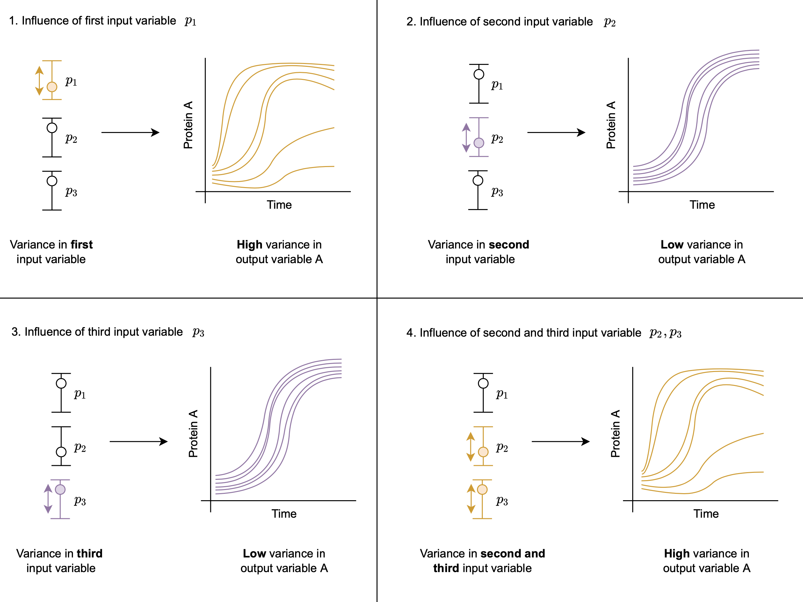

# Performing Global Sensitivity Analysis

DyadModelOptimizer helps users to consider additional model exploration based on Global Sensitivity Analysis (GSA). This approach is helpful to further investigate how the model output reacts to variance in the model input.
For example, we can analyse quantitatively how the variance in single input variables and how combinations of variances in several input variables affect output variables as shown in the figure below:

 1. Influence of first input variable,
 2. Influence of second input variable,
 3. Influence of third input variable,
 4. Influence of second and third input variable.



The [`GlobalSensitivity` package](https://docs.sciml.ai/GlobalSensitivity/stable/) provides a large variety of algorithms via `gsa(f, method)`.
The function that is used to compuite the sensitivity can be based on [`simulate`](@ref),
so that one can take advantage of already specified experiments. [^1]

For example let's consider the predator prey model and perform GSA using the Morris method.

```@example gsa
using DyadModelOptimizer
using GlobalSensitivity
using Statistics
using OrdinaryDiffEq
using ModelingToolkit
import ModelingToolkit: D_nounits as D, t_nounits as t
using Plots
gr(fmt=:png) # hide
using Test # hide

function lotka()
    @variables x(t)=3.1 y(t)=1.5
    @parameters α=1.3 β=0.9 γ=0.8 δ=1.8
    eqs = [
        D(x) ~ α * x - β * x * y,
        D(y) ~ -δ * y + γ * x * y,
    ]
    @named sys = ODESystem(eqs, t)
end

sys = complete(lotka())

tspan = (0.0, 10.0)

experiment = Experiment(nothing, sys;
    tspan,
    saveat = range(0, stop = 10, length = 200),
    alg = Tsit5()
)

prob = InverseProblem(experiment,
    [
        sys.α => (1.0, 5.0),
        sys.β => (1.0, 5.0),
        sys.γ => (1.0, 5.0),
        sys.δ => (1.0, 5.0),
    ])

function f(x)
    sol = simulate(experiment, prob, x)
    [mean(sol[:x]), maximum(sol[:y])]
end

lb = lowerbound(prob)
ub = upperbound(prob)

param_range = [[l, u] for (l, u) in zip(lb, ub)]

m = gsa(f, Morris(total_num_trajectory=1000, num_trajectory=150), param_range)
```

We can plot the results using
```@example gsa
scatter(m.means[1,:], m.variances[1,:], series_annotations=[:α,:β,:y,:δ], color=:gray)
```

and

```@example gsa
scatter(m.means[2,:], m.variances[2,:], series_annotations=[:α,:β,:y,:δ], color=:gray)
```

For the Sobol method, we can similarly do:
```@example gsa
m = gsa(f, Sobol(), param_range, samples=1000)
```

See the documentation for [GlobalSensitivity](https://docs.sciml.ai/GlobalSensitivity/stable/) for more details.

[^1]: Derived from https://docs.sciml.ai/GlobalSensitivity/stable/tutorials/parallelized_gsa/ from from https://github.com/SciML/SciMLDocs, MIT licensed, see repository for details.
