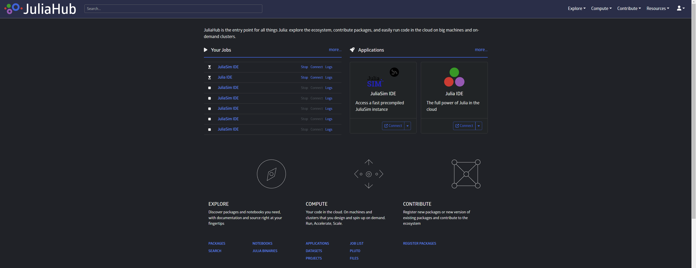
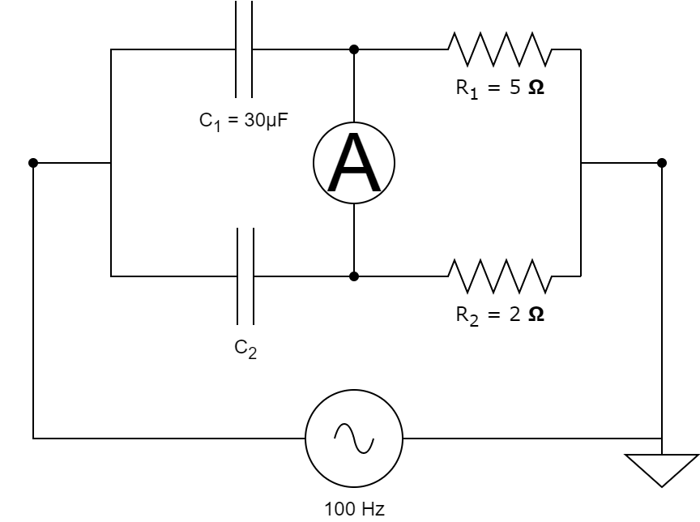

# [Getting Started with DyadModelOptimizer](@id getting_started_page)

## Accessing DyadModelOptimizer

In order to start using DyadModelOptimizer, you can either sign in on JuliaHub and start the JuliaSim IDE application or [use the JuliaHubRegistry to download the package locally](https://help.juliahub.com/juliasim/dev/gettingstarted/juliahubregistry/).

### Using DyadModelOptimizer on JuliaHub

After you sign in on [JuliaHub](https://juliahub.com/) (or your JuliaHub enterprise instance), go to Applications and then start a JuliaSim IDE app.



### [Using DyadModelOptimizer locally](@id locally)

In order to use the DyadModelOptimizer locally, you'll need to first add [PkgAuthentication](https://github.com/JuliaComputing/PkgAuthentication.jl) to your global environment.

```julia
using Pkg
original_active_project = Base.active_project()
try
    withenv("JULIA_PKG_SERVER" => nothing) do
        Pkg.activate("v$(VERSION.major).$(VERSION.minor)"; shared = true)
        Pkg.add("PkgAuthentication")
    end
finally
    Pkg.activate(original_active_project)
end
```

Next, configure Julia to be aware of [JuliaHub](https://juliahub.com/)'s package server (or your enterprise JuliaHub instance):

```julia
using PkgAuthentication
PkgAuthentication.install("juliahub.com")
```

Then add all known registries on [JuliaHub](https://juliahub.com/), including the JuliaHub registry, from the "Pkg REPL" (by pressing ] from the Julia REPL), using

```julia
Pkg.Registry.add()
```

!!! note

    The command above will only work on Julia v1.8 and later. On versions prior to v1.8 use the `pkg>` REPL command `registry add` instead.

This will open up a new browser window or tab and ask you to sign in to [JuliaHub](https://juliahub.com) or to confirm authenticating as an already logged in user.

!!! note

    This will _also_ change the package server to [JuliaHub](https://juliahub.com) for all Julia sessions that run `startup.jl`.

## [Fitting model parameters to data with DyadModelOptimizer](@id getting_started)

For many of the models that we have, we don't know all the parameters, so we need to calibrate them. To do that, we can either rely on experimental data that we have for the modelled system, or we can tune the parameters such that the system achieves a certain state. We will first look at the case where we have some experimental data and we want to fit the model such that the simulation matches the data. In the following tutorial we will solve the inverse problem of finding the model parameters starting from a capacitor bridge, also sometimes called De Sauty bridge.



This capacitor bridge consists of 2 capacitors, 2 resistors and an AC source with a frequency of 100Hz and 1V amplitude. We assume that we know the resistor values and the value of one of the capacitances, as shown above. We want to find the value of the unknown capacitance starting from some measurements obtained from the ampermeter.

### First steps

For this tutorial we will need the following packages:

| Module                                                                                         | Description                                                       |
|:---------------------------------------------------------------------------------------------- |:----------------------------------------------------------------- |
| [DyadModelOptimizer](https://help.juliahub.com/jsmo/stable/)                                   | This is used to formulate our inverse problem and solve it        |
| [ModelingToolkit](https://docs.sciml.ai/ModelingToolkit/stable/)                               | The symbolic modeling environment                                 |
| [ModelingToolkitStandardLibrary](https://docs.sciml.ai/ModelingToolkitStandardLibrary/stable/) | This provides model building blocks, such as the circuit elements |
| [OrdinaryDiffEq](https://docs.sciml.ai/DiffEqDocs/stable/)                                     | The numerical differential equation solvers                       |
| [Plots](https://docs.juliaplots.org/stable/)                                                   | The plotting and visualization library                            |

```@example calibrate_tutorial
using DyadModelOptimizer
using ModelingToolkit, OrdinaryDiffEq
using ModelingToolkit: t_nounits as t
using ModelingToolkitStandardLibrary.Electrical
using ModelingToolkitStandardLibrary.Blocks: Sine
using DyadData
using Plots
gr(fmt=:png) # hide
using Test # hide
```

### Model Setup

In order to solve the inverse problem, we must first define the circuit model.

```@example calibrate_tutorial
function create_model(; C₁ = 3e-5, C₂ = 1e-6)
    @named resistor1 = Resistor(R = 5.0)
    @named resistor2 = Resistor(R = 2.0)
    @named capacitor1 = Capacitor(C = C₁)
    @named capacitor2 = Capacitor(C = C₂)
    @named source = Voltage()
    @named input_signal = Sine(frequency = 100.0)
    @named ground = Ground()
    @named ampermeter = CurrentSensor()

    eqs = [connect(input_signal.output, source.V)
        connect(source.p, capacitor1.n, capacitor2.n)
        connect(source.n, resistor1.p, resistor2.p, ground.g)
        connect(resistor1.n, capacitor1.p, ampermeter.n)
        connect(resistor2.n, capacitor2.p, ampermeter.p)]

    @named circuit_model = ODESystem(eqs, t,
        systems = [
            resistor1, resistor2, capacitor1, capacitor2,
            source, input_signal, ground, ampermeter,
        ])
end

model = create_model()
sys = structural_simplify(model)
```

In the above, we first define the circuit components using [ModelingToolkitStandardLibrary](https://docs.sciml.ai/ModelingToolkitStandardLibrary/stable/) and then we connect them as in the diagram above. The units for the model are all in SI, as indicated in its documentation. The default value that we have provided for ``C_2`` is our initial guess for the capacitance value.

```@setup calibrate_tutorial
C₂ = 1e-5
true_model = create_model(C₂ = C₂)
true_sys = structural_simplify(true_model)
@unpack capacitor1, capacitor2 = true_model

invprob = ODEProblem(true_sys, [capacitor2.v => 0.0], (0., 0.1), [])
true_sol = solve(invprob, Rodas5P(), saveat=0.001)
```

### Data Setup

We can read tabular experimental data where the model names are matching column names in the table. The time dependence in the column names is optional. For example let's consider the following:

```@example calibrate_tutorial
data = DyadDataset("juliasimtutorials", "circuit_data", independent_var="timestamp", dependent_vars=["ampermeter.i(t)"])
```

We can now create an [`Experiment`](@ref) that would correspond to the experimental data above. The inverse problem is defined by the experiment, the model of the system and the search space. The search space is a vector of pairs, where the first element is the model variable (parameter or initial condition) that we want to find and the second represents the bounds in which we believe the value can be.

```@example calibrate_tutorial
@unpack capacitor1, capacitor2 = model
experiment = Experiment(data, sys; overrides = [capacitor2.v => 0.0])
invprob = InverseProblem(experiment, [capacitor2.C => (1.e-7, 1e-3)])
```

### Calibration

We can now calibrate the model parameters to the data using a calibration method of our choice. The simplest method that we can start with is [`SingleShooting`](@ref). We use [`IpoptOptimizer`](@ref) for defining our optimizer.

```@example calibrate_tutorial
alg = SingleShooting(maxiters = 100, optimizer = IpoptOptimizer(; tol = 1e-6))
r = calibrate(invprob, alg)
@test only(r)≈C₂ rtol=1e-3 # hide
r # hide
```

To check that the result is correct, we can plot the solution of the simulated ampermeter readings to the experimental ones. To include the data in the plot, we use `show_data=true`. As systems can have a very large amount of states, the legend is not shown by default, so we turn that on with `legend=true`.

```@example calibrate_tutorial
plot(experiment, invprob, r, show_data = true, legend = true)
```

We can also try another calibration algorithm, such as [`MultipleShooting`](@ref), which would split the data into multiple groups and fit them individually and impose a continuity condition via a penalty in the loss function, for which the magnitude is set with `continuitylossweight`. We can also specify `maxtime` as stopping criteria instead of `maxiters`.

```@example calibrate_tutorial
alg = MultipleShooting(maxiters = 200, trajectories = 7, continuitylossweight = 1.0, optimizer = IpoptOptimizer(; tol = 1e-6, hessian_approximation="exact"), initialization = DataInitialization())
r = calibrate(invprob, alg)
@test only(r)≈C₂ rtol=1e-2 # hide
r # hide
```

Again, to check that the solution is correct, we can plot the result of the simulated experiment with the calibration result and compare it against the data.

```@example calibrate_tutorial
plot(experiment, invprob, r, show_data = true, legend = true)
```

If we want to inspect other states of the model, we can use the `states` keyword argument.

```@example calibrate_tutorial
@unpack capacitor2, resistor1 = model
plot(experiment, invprob, r, states = [capacitor2.v, resistor1.v], legend = true, ylabel = "V")
```

## Design Optimization with DyadModelOptimizer

Similarly to how we can use a [Wheatstone bridge](https://en.wikipedia.org/wiki/Wheatstone_bridge) to determine an unknown resistance by varying a variable resistance, we can build a capacitance bridge in which we find and unknown capacitance. In the following, instead of assuming that we can vary one of the resistances, we directly calibrate the capacitance value of the unknown capacitor, such that the current through the ampermeter is 0.

Design problems usually require tuning model parameters such that certain goals are attained. In some cases our objective function might not be depend on measurement data, such as in fitting problems, but instead we might want the system to achieve a certain state. DyadModelOptimizer can be used for both of these usecases and in the following we will present a design optimization problem starting from the above defined capacitor bridge.

```@example calibrate_tutorial
t0 = 0.0
tend = 0.1

@unpack ampermeter, capacitor1, capacitor2 = model

config = DesignConfiguration(sys;
    overrides = [capacitor2.v => 0.0],
    tspan = (t0, tend),
    running_cost = abs2(ampermeter.i),
    reduction = sum)

invprob = InverseProblem(config, [capacitor2.C => (1.e-7, 1e-3)])
```

As we don't have data in this case, we need to provide a timespan for our experiment and an error function to be minimized. The inverse problem definition looks the same as above, as we have the same system and the same search space.

### Calibration

We define the experiment without any data, but we supply a custom error function, such that we enforce that no current passes through the ampermenter. This is equivalent with balancing the bridge by modifying the resistances. This means that we can verify our calibration result with the known analytic results for this particular configuration,

```math
C_2 = C_1 * \frac{R_1}{R_2}.
```

The simplest calibration method that we can try is [`SingleShooting`](@ref).

```@example calibrate_tutorial
alg = SingleShooting(maxiters = 100, optimizer = IpoptOptimizer(; tol = 1e-6))
r = calibrate(invprob, alg)
@test only(r) ≈ 7.5e-5 rtol=1e-5 # hide
r # hide
```

As we can see, we obtain the correct result ``C_2 = 75μF``. We can check that the system behaves how we expect, namely that we don't have current through the ampermeter. To do this, we can plot result of the experiment using the calibration result that we obtained above.

```@example calibrate_tutorial
plot(config, invprob, r, states = ampermeter.i, legend = true)
```

We can also try [`MultipleShooting`](@ref), so that we split the above oscillations in multiple groups and instead of trying to cancel all of them at the same time, we can just find a solution that minimizes parts of a single oscillation and enforce the continuity of the solution.

```@example calibrate_tutorial
alg = MultipleShooting(maxtime = 300, trajectories = 50, continuitylossweight=0.1, initialization = RandomInitialization())
r = calibrate(invprob, alg)
@test only(r) ≈ 7.5e-5 rtol=1e-2 # hide
r # hide
```

We can again check that the system behaves as expected.

```@example calibrate_tutorial
plot(config, invprob, r, states = ampermeter.i, legend = true)
```
