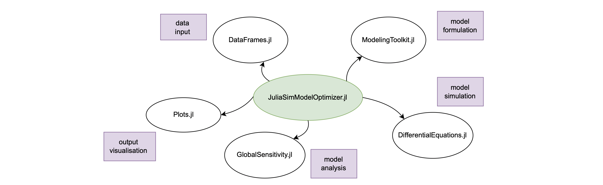

# DyadModelOptimizer: Automated Solution of Complex Inverse Problems

!!! info

    JuliaSim is a proprietary software developed by JuliaHub Inc. It is free to use for non-commercial academic teaching and research purposes. For commercial users, license fees apply. Please refer to the [End User License Agreement](https://juliahub.com/company/eula/) for details. Please contact [sales@juliahub.com](mailto:sales@juliahub.com) for purchasing information.

DyadModelOptimizer is a package and a methodology designed to solve difficult model calibration problems and analyses in a high-performance and user friendly manner. This allows for scaling to large models and datasets without requiring advanced programming. This also allows the user to stay focused on modeling and interpretation, leaving the details of robustly performing parameter estimation to an automated system. At the same time, automatic, under-the-hood parallelizations, enable a scalable framework to ensure that the hardest inverse problems are easily accessible.

## Overview of DyadModelOptimizer

DyadModelOptimizer is centered around solving [`InverseProblem`](@ref)s, i.e. finding the parameters which make models fit the behavior observed in data. In DyadModelOptimizer, an [`Experiment`](@ref) consists of a model and a dataset. For example, an experiment might be a differential-equation model describing an HVAC system attached to a building with multiple datasets of the system's performance to which the model is supposed to be calibrated against. The multi-experiment setup of DyadModelOptimizer allows the user to quickly describe the multiple scenarios in which the identification data was collected, monitoring the response of the system to fluctuating outside temperatures under different operating scenarios. The user can then easily solve the multi-objective optimization problem via an [`InverseProblem`](@ref), which in this case is a collection of experiments.

DyadModelOptimizer offers many different analysis functions to enable such model calibration and exploration. At a high level, these are:

  - [`calibrate`](@ref): the fitting of an [`InverseProblem`](@ref), i.e. finding the best parameters to simultaneously fit all experiments. This function is made to be fast and robust, making it easy to perform difficult calibrations.
  - [`parametric_uq`](@ref): parametric uncertainty quantification finds a set of parameters which are all sufficiently good fits to all datasets. This is an extension of [`calibrate`](@ref) which is used to convey uncertainty with respect to global parameter identifiability in the model fitting process and allow for analysis with respect to model uncertainty and data noise.

## DyadModelOptimizer's Integration with Julia and SciML

DyadModelOptimizer is written in Julia and therefore brings all the advantages of the Julia language with it: this includes, for example, an easy-to-read and write syntax and a high baseline performance. Additionally, DyadModelOptimizer is nicely integrated with the existing package ecosystem of Julia. Specifically relevant are the connections to the following packages:

  - [DataFrames.jl](https://dataframes.juliadata.org/stable/) allows us to manipulate tabular data and hence is useful to handle trail data stored in e.g. csv files.
  - [ModelingToolkit.jl](https://github.com/SciML/ModelingToolkit.jl) provides a modeling framework for high-performance symbolic-numeric computation  hence allows for smooth model definitions and model handling.
  - [DifferentialEquations.jl](https://docs.sciml.ai/DiffEqDocs/stable) can be used to numerically solving differential equations with high efficiency.
  - [GlobalSensitivity.jl](https://gsa.sciml.ai/dev/) provides several methods to quantify the uncertainty in the model output with respect to the input parameters of the model.
  - [Plots.jl](https://github.com/JuliaPlots/Plots.jl) is a plotting API and toolset that can be used to intuitively analyse and visualise model behaviour and output.
