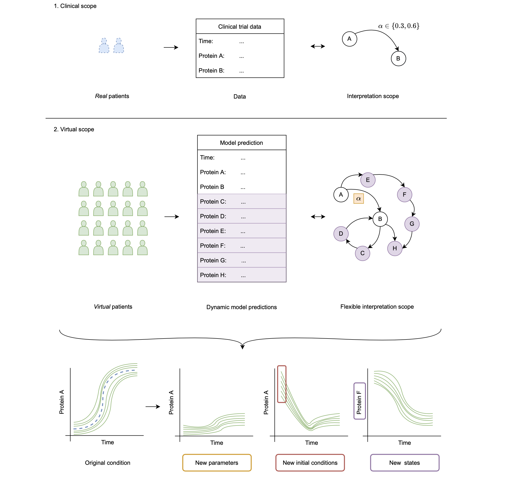

# [Parametric uncertainty quantification](@id parametric_uq)

In DyadModelOptimizer one can perform parametric uncertainty quantification using `parametric_uq` with an `InverseProblem`. The result of a `parametric_uq` call is a set of parameters which sufficiently fit all experiments to their respective data simultaneously. We refer to this as the ensemble of plausible parameters.

## The `parametric_uq` Function

```@docs
parametric_uq
```

## Optimization Methods

The following are the choices of algorithms which are available for controlling the parametric uncertainty quantification process:

```@docs
StochGlobalOpt
```

## Result Types

```@docs; canonical=false
ParameterEnsemble
```

## Importing Parameter ensembles

If an ensemble of parameters was generated in some alternative way, DyadModelOptimizer still allows for importing these values into a `ParameterEnsemble` to enable using the parametric uncertainty quantification analysis workflow. This is done via the following function:

```@docs; canonical=false
import_ps
```

## Analyzing Parameter Ensemble Results

Once parameters (PS) are generated given some multi-experiment data, we can use them to expand our analysis scope to dimensions where, for example, experimental data collection is difficult. This objective is schematically shown in the figure below. Here, we summarise three groups:

 1. We can use the PS to model the system for new values of model parameters. Note that here we refer to model parameters not as parameters that specify a patient, but other, independent parameters of the model. As an example we have the reaction rate α.
 2. We can use the PS to model the system for new initial conditions for the observed states of the system. Here, this relates to Protein A and B.
 3. We can use the PS to model states of the system that have not been observed. These are Protein C to H in this example.



The following functions enable such analyses:

```@docs
solve_ensemble
```
