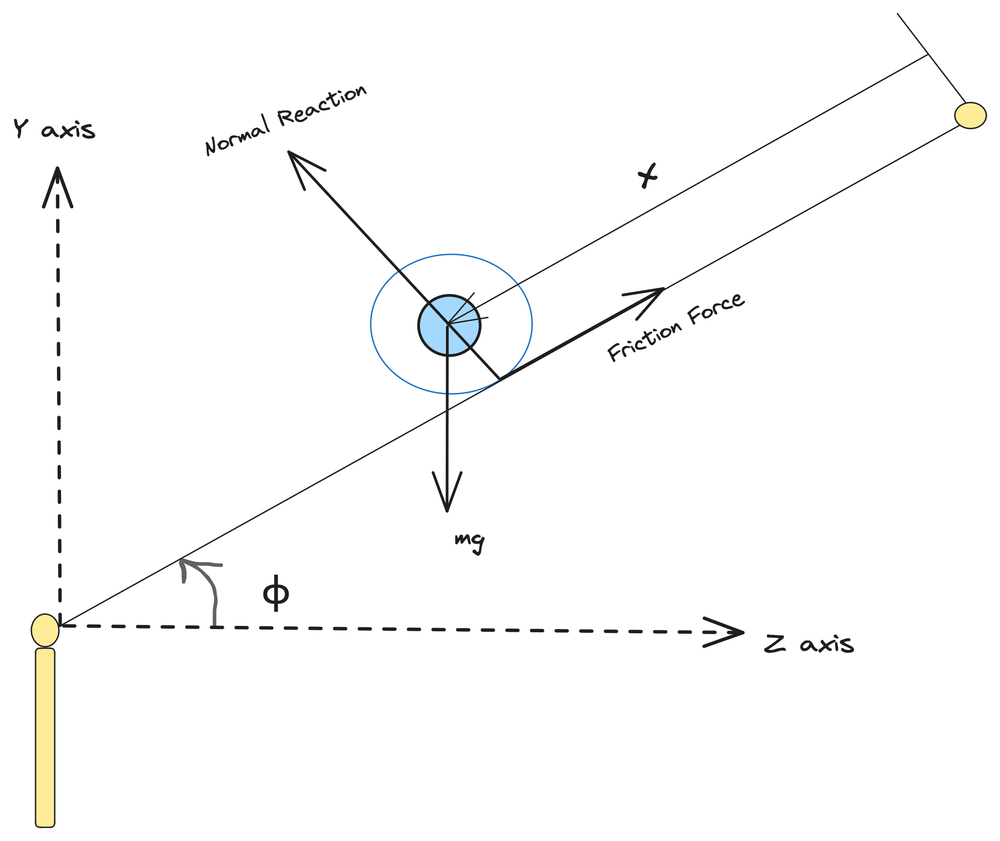
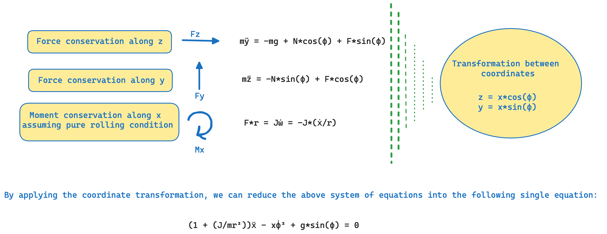

# [Calibration of an Unstable Dynamical System using Prediction Error Method](@id BallBeamControls)

In this tutorial we show how can one use Prediction Error Method for calibration of an unstable dynamical system, namely the "ball and beam" system.

As shown in the schematic below, in this case, our process model involves, a horizontal beam and a motor. The control objective is to balance a rolling ball on the beam, when the position of the ball changes, by controlling the beam angle using a motor. Here, the system has three parameters namely ${I, g, f_v}$, where `I` stands for the non-dimensional parameter, ${J/(m*r^2)}$, which is analytically 0.4 in this case for the spherical-ball, `g` stands for the acceleration due to gravity, and ${f_v}$ stands for the Coulomb's friction coefficient parameter, with all units taken in S.I. Assuming there is negligible dynamics inside the motor components, hence the angular velocity of beam, is directly proportional to the input. The dynamical equations of the ball, based on the classical mechanics for a Coulomb's friction model, can be derived from the conservation equations described below.





The dataset for this system, has been collected from the ball-and-beam experiment setup in the [STADIUS's Identification Database](https://homes.esat.kuleuven.be/%7Esmc/daisy/daisydata.html).

The measured signals out of this process, are two of the state variables of the problem, the beam angle relative to the horizontal plane (φ) and the position of the ball (x). First, we start the problem, by defining the governing system of ODEs, that consists of the following equations:-

```math
\begin{aligned}
\frac{d\phi}{dt} &= f^n(t)   \\
(1+ I) \frac{d^2x}{dt^2} - x (\frac{d\phi}{dt})^2 + f_v \frac{dx}{dt} + g sin(\phi) &=  0  \\
\end{aligned}
```

## Julia Environment

For this tutorial we will need the following packages:

| Module                                                                                              | Description                                                                                |
|:--------------------------------------------------------------------------------------------------- |:------------------------------------------------------------------------------------------ |
| [DyadModelOptimizer](https://help.juliahub.com/jsmo/stable/)                                       | The high-level library used to formulate our problem and perform automated model discovery |
| [ModelingToolkit](https://docs.sciml.ai/ModelingToolkit/stable/)                                    | The symbolic modeling environment                                                          |
| [ModelingToolkitStandardLibrary](https://docs.sciml.ai/ModelingToolkitStandardLibrary/stable/)      | Library for using standard modeling components                                             |
| [OrdinaryDiffEq](https://docs.sciml.ai/DiffEqDocs/stable/)              | The numerical differential equation solvers                                                |
| [CSV](https://csv.juliadata.org/stable/) and [DataFrames](https://dataframes.juliadata.org/stable/) | We will read our experimental data from .csv files                                         |
| [DataSets](https://help.juliahub.com/juliahub/stable/tutorials/datasets_intro/)                     | We will load our experimental data from datasets on JuliaHub                               |
| [DataInterpolations](https://docs.sciml.ai/DataInterpolations/stable/)                              | Library for creating interpolations from the data                                          |
| [ForwardDiff](https://juliadiff.org/ForwardDiff.jl/stable/)                                         | Library for Forward Mode Automatic Differentiation                                         |
| [Plots](https://docs.juliaplots.org/stable/)                                                        | The plotting and visualization library                                                     |

```@example ballbeamcontrols
using DyadModelOptimizer
using ModelingToolkit
import ModelingToolkit: D_nounits as D, t_nounits as t
using ModelingToolkitStandardLibrary.Blocks
using OrdinaryDiffEq
using CSV, DataFrames
using DyadData
using DataInterpolations
using Plots
gr(fmt=:png) # hide
using Test # hide
```

## Data Setup

```@example ballbeamcontrols
training_dataset = DyadDataset("juliasimtutorials", "ball_beam", independent_var="timestamp", dependent_vars=["ϕ", "x"])

df = build_dataframe(training_dataset)
first(df, 5)
```

## Model Setup

```@example ballbeamcontrols
t_vec = df[!, "timestamp"]
ϕ_vec = df[:, "ϕ"]

input_func = CubicSpline(ϕ_vec, t_vec)
dinput_vec = map(Base.Fix1(DataInterpolations.derivative, input_func), t_vec)

function ballandbeamsystem(ϕ_vec, t_vec)
    @variables x(t)=-4.8851980e-03 ϕ(t)=-1.9634990e-03
    @parameters I=0.2 g=9.8 Fv=1.0

    @named src = Interpolation(CubicSpline, ϕ_vec, t_vec)
    @named clk = ContinuousClock()
    @named Dϕ_input = RealInput()

    eqs = [
        connect(clk.output, src.input),
        connect(src.output, Dϕ_input),
        D(ϕ) ~ Dϕ_input.u,
        0 ~ (1 + I) * D(D(x)) - x * (D(ϕ))^2 - g * sin(ϕ) + Fv * D(x),
    ]
    @named ballandbeam = ODESystem(eqs, t; systems = [Dϕ_input, src, clk])
end

model = ballandbeamsystem(dinput_vec, t_vec)
sys = structural_simplify(model)
nothing # hide
```

The data that we have for the system corresponds to the angle of the beam relative to the horizontal plane (φ) and the position of the ball on the beam (x). Also, in this system, we need to pass the un-initialised dummy derivatives terms to the existing initialized variable map.

## Defining Experiment and InverseProblem

In order to create an [`Experiment`](@ref), we will use the default initial values of the states and parameters of our model. These are our initial guesses which will be used to optimize the inverse problem in order to fit the given data.

```@example ballbeamcontrols
experiment = Experiment(df, sys, abstol=1e-8, reltol=1e-6, overrides = [D(sys.x) => dinput_vec[1]])
```

Once we have created the experiment, the next step is to create an [`InverseProblem`](@ref). This inverse problem, requires us to provide the search space as a vector of pairs corresponding to the parameters that we want to recover and the assumption that we have for their respective bounds.

```@example ballbeamcontrols
prob = InverseProblem(experiment, [sys.I => (0.0, 10.0), sys.Fv => (0.0, 2.0)])
```

## Calibration

### SingleShooting

Let us first try to solve this problem using [`SingleShooting`](@ref). To do this, we first define an algorithm `alg` and then call [`calibrate`](@ref) with the `prob` and `alg`.

```@example ballbeamcontrols
alg = SingleShooting(maxiters = 1000)
r1 = calibrate(prob, alg)
```

The calibrated parameters don't look right. The value of `I` and `Fv` seems to be very high. We can use these parameters to simulate it and plot to see if it fits the data well.

```@example ballbeamcontrols
plot(experiment, prob, r1, show_data = true, ms = 1.0, size = (1000, 600), layout = (2, 1), legend=true)
```

### SingleShooting with Prediction Error Method

We can see that the simulation does not match the data at all! It is because this is an unstable system and hence simulating is very difficult. So, the calibration process is also very difficult as simulations will diverge and we can never fit the data correctly. To mitigate this, we will use Prediction Error Method where the simulation is guided by the data such that the trajectory won't diverge and this should help with the calibration process.

To use Prediction Error Method, we need to pass it in the `model_transformations` keyword in the constructor of the [`Experiment`](@ref).

```@example ballbeamcontrols
experiment = Experiment(df, sys, abstol=1e-8, reltol=1e-6, overrides = [D(sys.x) => dinput_vec[1]], model_transformations = [DiscreteFixedGainPEM(0.3)])
prob = InverseProblem(experiment, [sys.I => (0.0, 10.0), sys.Fv => (0.0, 2.0)])
```

Argument passed to `DiscreteFixedGainPEM` is the amount of correction needed during simulation. `1.0` represents completely using the data and `0.0` represents completely ignoring the data. Typically, we should use this be about 0.2-0.3 to help guide the simulation.

Now, if we try calibrating, we get:

```@example ballbeamcontrols
alg = SingleShooting(maxiters = 1000)
r2 = calibrate(prob, alg)
@test r2[:I] < r1[:I] # hide
@test r2.original.objective < 0.07 # hide
r2
```

The calibrated value of `I` looks a bit high but it is closer to its theoretical value from using only [`SingleShooting`](@ref). We can again use the calibrated parameters to simulate it and see if it fits the data well.

```@example ballbeamcontrols
plot(experiment, prob, r2, show_data = true, ms = 1.0, size = (1000, 600), layout = (2, 1), legend=true)
```

It does fit the data well! The calibrated parameters look a bit high than their theoretical values as the model may not be a sufficient representation of the real world experiment from where the data was collected. One way to improve the results to have a more sophisticated model to improve the results, i.e., get the values of the calibrated parameters closer to what they actually represent. But one can see that using Prediction Error Method, the results improve drastically, from not fitting the data at all to closely fitting the data which also helps in the calibration process.
